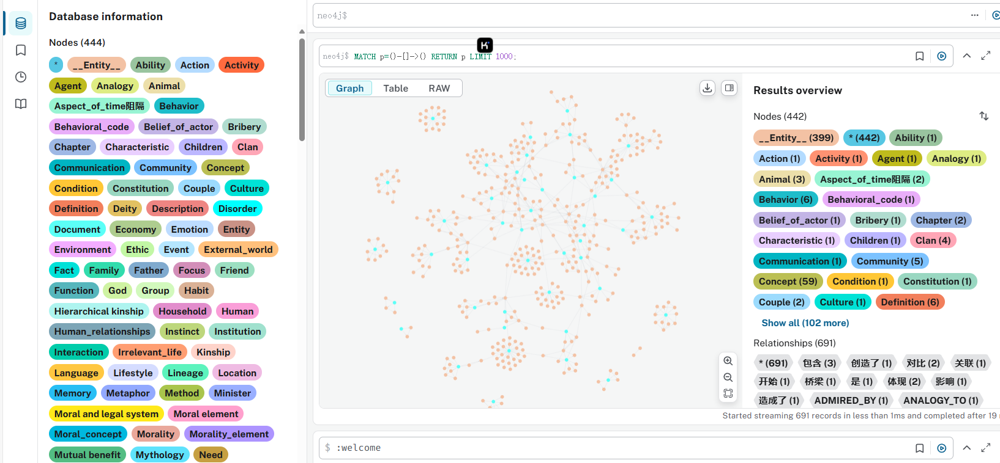

# GraphRAG with Llama 3.1

A Graph-based Retrieval Augmented Generation (GraphRAG) implementation using Llama 3.1 and Neo4j. This project processes documents, extracts entities and relationships using LLMs, and stores the knowledge graph in Neo4j for advanced question-answering capabilities.



## Features

- Document processing and chunking
- LLM-based knowledge graph extraction
- Neo4j integration for graph storage
- Vector embeddings for semantic search
- Entity extraction capabilities
- Progress tracking for long-running operations
- Batch processing with progress indicators

## Requirements

- Python 3.8+
- Ollama with models:
  - qwen2.5 (default LLM model)
  - nomic-embed-text (for embeddings)
- Neo4j database instance
- Required Python packages:
  - langchain and langchain_experimental
  - neo4j
  - pydantic
  - tqdm
  - yfiles_jupyter_graphs

## Installation

1. Clone this repository:
```bash
git clone https://github.com/yourusername/GraphRAG-with-Llama-3.1.git
cd GraphRAG-with-Llama-3.1
```

2. Install required packages:
```bash
pip install -r requirements.txt
```

3. Set up Neo4j database instance (local or cloud)

4. Make sure Ollama is running with the required models:
```bash
ollama pull qwen2.5
ollama pull nomic-embed-text
```

## Configuration

Modify the following variables in `main.py` to match your environment:

```python
# Neo4j connection parameters
NEO4J_URL = "bolt://localhost:7687"
NEO4J_USER = "neo4j"
NEO4J_PASSWORD = "your_password"

# Document processing parameters
CHUNK_SIZE = 256  # Size of document chunks
CHUNK_OVERLAP = 24  # Overlap between chunks
LLM_MODEL = "qwen2.5"  # Ollama model to use
DOCUMENT_PATH = " document.txt"  # Path to your document
```

## Usage

Run the main script to process a document and build the knowledge graph:

```bash
python main.py
```

The process includes:
1. Loading and processing documents
2. Converting documents to graph format
3. Saving extracted graph documents
4. Initializing Neo4j graph
5. Adding graph documents to Neo4j
6. Creating vector and fulltext indices
7. Setting up entity extraction

## How it Works

This project implements a GraphRAG approach:

1. **Document Processing**: Text documents are loaded and split into manageable chunks.
2. **Knowledge Graph Extraction**: An LLM identifies entities and relationships from text.
3. **Graph Storage**: The extracted knowledge is stored in Neo4j as a graph.
4. **Vector Embeddings**: Document chunks are embedded for semantic search.
5. **Retrieval**: When querying, the system can use both graph traversal and vector similarity.
6. **Entity Extraction**: A separate chain extracts entities from arbitrary text.

## Results

Extracted graph documents are saved in the `results` directory with timestamps. These files contain the identified nodes, relationships, and their properties.

## License

[MIT]
