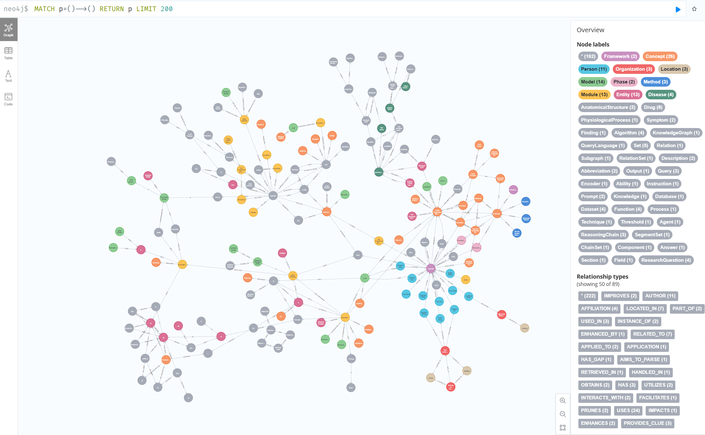

# GraphRAGFlow


A Graph-based Retrieval Augmented Generation (GraphRAG) implementation using Ollama or OpenAI API support LLMs and Neo4j Graph database. This project processes documents, extracts entities and relationships using LLMs, and stores the knowledge graph in Neo4j for advanced question-answering capabilities.

here is demo in neo4j


## ✨ Features

- Document processing and chunking
- LLM-based knowledge graph extraction
- Fix for handling string `target` attributes during graph document preprocessing
- Neo4j integration for graph storage
- Vector embeddings for semantic search
- Entity extraction capabilities
- Progress tracking for long-running operations
- Batch processing with progress indicators

## 🚀 Quickstart

### Neo4j Setup with Docker

If you don't have a Neo4j environment, you can easily set up your own using Docker:

1. Create a `docker-compose.yml` file in the project root with the following content:

```yaml
version: '3'
services:
  neo4j:
    image: neo4j:5.13.0
    container_name: neo4j-graphrag
    ports:
      - "7474:7474"  # HTTP
      - "7687:7687"  # Bolt
    volumes:
      - ./neo4j/data:/data
      - ./neo4j/logs:/logs
      - ./neo4j/import:/import
      - ./neo4j/plugins:/plugins
    environment:
      - NEO4J_AUTH=neo4j/your_password  # Change this password
      - NEO4J_dbms_memory_heap_initial__size=1G
      - NEO4J_dbms_memory_heap_max__size=2G
      - NEO4J_dbms_memory_pagecache_size=1G
      # Enable vector index support
      - NEO4J_dbms_security_procedures_unrestricted=gds.*,apoc.*,vectorize.*
      - NEO4J_dbms_security_procedures_allowlist=gds.*,apoc.*,vectorize.*
      # Install Neo4j plugins (APOC, GDS, Vectorize)
      - NEO4J_PLUGINS=["apoc", "graph-data-science", "n10s"]
```

2. Start the Neo4j container:

``` bash
docker-compose up -d
```

3. Access the Neo4j Browser at http://localhost:7474 to verify the installation

### Requirements

- Python 3.8+
- Ollama with models:
  - qwen2.5 (default LLM model)
  - nomic-embed-text (for embeddings)
- OpenAI API support models:
- Neo4j database instance
- Required Python packages:
  - langchain and langchain_experimental
  - neo4j
  - pydantic
  - tqdm
  - fastapi
  - uvciorn
  - pypdf


### Installation

recomend using uv for package management

1. Clone this repository:
```bash
git clone https://github.com/weijunjiang123/GraphRAG-with-Ollama.git
cd GraphRAG-with-Ollama
```

2. Install required packages with uv:
```bash
uv sync
```

3. Set up Neo4j database instance (local or cloud),if you don't setup checkout [this](#neo4j-setup-with-docker)

4. Make sure Ollama is running with the required models:

```bash
ollama pull qwen2.5
ollama pull nomic-embed-text
```

or you can config api key in .env

### Configuration

copy the .env.example to .env

```sh
cp .env.example .env
```

Modify the following variables in `.env` to match your environment: 

checkout [this](/.env.example) for detail


### Usage

Run the main script to process a document and build the knowledge graph:

```bash
uv run main.py
```

The process includes:
1. Loading and processing documents
2. Converting documents to graph format
3. Saving extracted graph documents
4. Initializing Neo4j graph
5. Adding graph documents to Neo4j
6. Creating vector and fulltext indices
7. Setting up entity extraction

## 🔧 How it Works

This project implements a GraphRAG approach:

1. **Document Processing**: Text documents are loaded and split into manageable chunks.
2. **Knowledge Graph Extraction**: An LLM identifies entities and relationships from text.
3. **Graph Storage**: The extracted knowledge is stored in Neo4j as a graph.
4. **Vector Embeddings**: Document chunks are embedded for semantic search.
5. **Retrieval**: When querying, the system can use both graph traversal and vector similarity.
6. **Entity Extraction**: A separate chain extracts entities from arbitrary text.

## Directory Structure

```
GraphRAG-with-Llama-3.1/
├── .env.example             # Example environment variables
├── .gitignore                # Specifies intentionally untracked files that Git should ignore
├── main.py                   # Main script to run the application
├── README.md                 # Documentation for the project
├── requirements.txt          # List of Python dependencies
├── src/                      # Source code directory
│   ├── config.py             # Configuration settings
│   ├── core/                 # Core logic and modules
│   │   ├── document_processor.py # Handles document loading and chunking
│   │   ├── embeddings.py       # Manages embeddings creation and vector index
│   │   ├── entity_extraction.py# Extracts entities from text
│   │   ├── graph_transformer.py# Converts documents to graph format
│   │   ├── neo4j_manager.py    # Manages Neo4j database operations
│   │   └── ...               # Other core modules
│   ├── utils.py              # Utility functions
├── data/                     # Directory for storing data files
│   └── ...                   # Documents to be processed
├── results/                  # Directory for storing output files
│   └── ...                   # Extracted graph documents
└── ...                       # Other directories and files
```

## Contributing

Contributions are welcome! Please fork the repository and submit a pull request with your changes.

## Reference

https://github.com/Coding-Crashkurse/GraphRAG-with-Llama-3.1

## License

[MIT]
