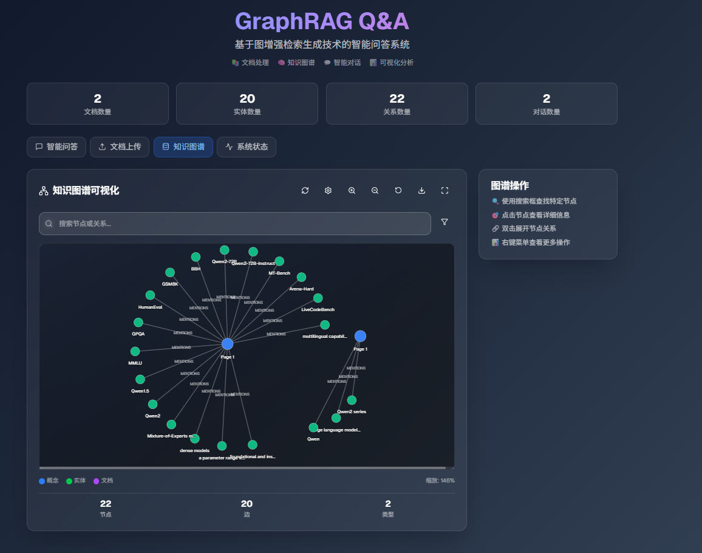
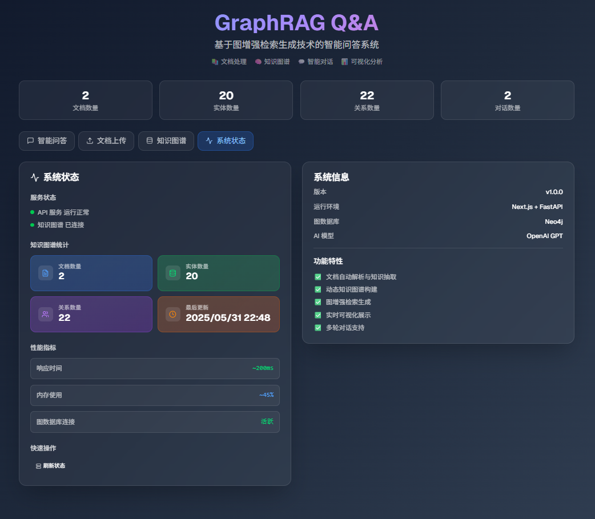

# GraphRAGFlow 前端说明

本项目前端基于 [Next.js](https://nextjs.org) 构建，使用 `create-next-app` 脚手架初始化，具备现代化开发体验和高效的页面渲染能力。

## 前端更新内容

- 使用 Next.js 进行前端开发，支持服务端渲染和静态生成
- 页面结构优化，提升用户体验
- 集成 [`next/font`](https://nextjs.org/docs/app/building-your-application/optimizing/fonts) 自动优化字体加载，默认使用 [Geist](https://vercel.com/font)
- 支持热更新，开发效率高
- 代码结构清晰，便于扩展和维护

## 快速开始

1. 安装依赖：

```bash
npm install
# 或
yarn install
# 或
pnpm install
# 或
bun install
```

2. 启动开发服务器：

```bash
npm run dev
# 或
yarn dev
# 或
pnpm dev
# 或
bun dev
```

3. 打开浏览器访问 [http://localhost:3000](http://localhost:3000)

页面代码位于 `app/page.tsx`，支持热更新。

## 项目截图




## 了解更多

- [Next.js 官方文档](https://nextjs.org/docs)
- [Next.js 教程](https://nextjs.org/learn)
- [Next.js GitHub 仓库](https://github.com/vercel/next.js)

## 部署

推荐使用 [Vercel](https://vercel.com/new?utm_medium=default-template&filter=next.js&utm_source=create-next-app&utm_campaign=create-next-app-readme) 平台一键部署。

更多部署方式请参考 [Next.js 部署文档](https://nextjs.org/docs/app/building-your-application/deploying)。
